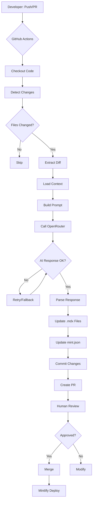

# 🏗️ Blueprint: Sistema di Documentazione Automatica con Mintlify + OpenRouter

## 📋 Panoramica

Sistema di documentazione automatica che analizza le modifiche al codice e aggiorna automaticamente la documentazione Mintlify utilizzando AI tramite OpenRouter e GitHub Actions.

## 🎯 Obiettivi

- ✅ Documentazione automatica su ogni PR
- ✅ Utilizzo di Mintlify per il sito di documentazione
- ✅ OpenRouter per accesso a modelli AI (Claude, GPT-4, ecc.)
- ✅ Completamente automatizzato con GitHub Actions
- ✅ Indipendente da Claude Code

## 🏛️ Architettura

```
┌─────────────────────────────────────────────────────────────┐
│                     REPOSITORY GITHUB                        │
├─────────────────────────────────────────────────────────────┤
│                                                               │
│  ┌──────────────┐                                            │
│  │   PR Aperta  │                                            │
│  └──────┬───────┘                                            │
│         │                                                     │
│         ▼                                                     │
│  ┌──────────────────────────────────────────────┐           │
│  │      GitHub Actions Workflow Trigger         │           │
│  └──────────────┬───────────────────────────────┘           │
│                 │                                             │
│                 ▼                                             │
│  ┌──────────────────────────────────────────────┐           │
│  │  1. Analisi File Modificati (git diff)       │           │
│  └──────────────┬───────────────────────────────┘           │
│                 │                                             │
│                 ▼                                             │
│  ┌──────────────────────────────────────────────┐           │
│  │  2. Script Python/Node.js                    │           │
│  │     - Legge i file modificati                │           │
│  │     - Legge la documentazione esistente      │           │
│  │     - Prepara il prompt per l'AI             │           │
│  └──────────────┬───────────────────────────────┘           │
│                 │                                             │
│                 ▼                                             │
│  ┌──────────────────────────────────────────────┐           │
│  │  3. Chiamata API OpenRouter                  │◄──────────┤─── API KEY (Secret)
│  │     - Invia contesto + file modificati       │           │
│  │     - Riceve suggerimenti documentazione     │           │
│  └──────────────┬───────────────────────────────┘           │
│                 │                                             │
│                 ▼                                             │
│  ┌──────────────────────────────────────────────┐           │
│  │  4. Aggiornamento File Mintlify              │           │
│  │     - Crea/modifica .mdx files               │           │
│  │     - Aggiorna mint.json se necessario       │           │
│  └──────────────┬───────────────────────────────┘           │
│                 │                                             │
│                 ▼                                             │
│  ┌──────────────────────────────────────────────┐           │
│  │  5. Commit & Push                            │           │
│  │     - Crea nuovo branch                      │           │
│  │     - Commit delle modifiche                 │           │
│  │     - Apre PR automatica                     │           │
│  └──────────────────────────────────────────────┘           │
│                                                               │
└───────────────────────────────────────────────────────────────┘
                              │
                              ▼
                   ┌──────────────────────┐
                   │  Mintlify Deploy     │
                   │  (docs.tuosito.com)  │
                   └──────────────────────┘
```

## 🔧 Componenti Principali

### 1. **Struttura Repository**

```
my-project/
├── .github/
│   └── workflows/
│       └── auto-docs.yml          # GitHub Action principale
├── docs/                          # Directory Mintlify
│   ├── mint.json                  # Configurazione Mintlify
│   ├── introduction.mdx
│   ├── api-reference/
│   ├── guides/
│   └── ...
├── scripts/
│   ├── doc-agent.js               # Script principale AI
│   ├── prompt-templates.js        # Template prompts
│   └── mintlify-utils.js          # Utilities Mintlify
├── .doc-agent-config.json         # Configurazione agente
└── README.md
```

### 2. **GitHub Actions Workflow**

**Trigger**: Pull Request verso branch principale
**Steps**:
1. Checkout del codice
2. Identificazione file modificati
3. Esecuzione script documentazione
4. Creazione PR con aggiornamenti

### 3. **Script Agente Documentazione**

**Linguaggio**: Node.js o Python
**Funzionalità**:
- Analizza diff dei file
- Legge documentazione esistente
- Costruisce prompt contestuale
- Chiama OpenRouter API
- Genera/aggiorna file .mdx
- Gestisce mint.json

### 4. **OpenRouter Integration**

**Modelli disponibili**:
- `anthropic/claude-3.5-sonnet` (raccomandato)
- `openai/gpt-4-turbo`
- `google/gemini-pro-1.5`

**Vantaggi**:
- Singola API per tutti i modelli
- Costi trasparenti
- Fallback automatico

## 📝 Flusso di Lavoro

### Scenario: Developer fa modifiche al codice

1. **Developer crea PR** con modifiche a `src/auth/login.ts`

2. **GitHub Action si attiva** e:
   - Rileva: `src/auth/login.ts` modificato
   - Estrae: diff delle modifiche
   - Legge: `docs/api-reference/auth.mdx` esistente

3. **Script invia a OpenRouter**:
   ```
   Prompt: "Analizza queste modifiche al modulo auth e aggiorna 
   la documentazione di conseguenza. Mantieni lo stile Mintlify."
   
   Contesto:
   - File modificato: src/auth/login.ts
   - Diff: [...]
   - Documentazione attuale: [...]
   - Struttura Mintlify: [mint.json]
   ```

4. **AI risponde** con:
   - Documentazione aggiornata in formato .mdx
   - Eventuali nuove pagine necessarie
   - Modifiche a mint.json

5. **Script applica modifiche**:
   - Aggiorna `docs/api-reference/auth.mdx`
   - Crea commit: "docs: update auth documentation"
   - Apre PR: "📚 Auto-docs: Auth module updates"

6. **Review umana**: Developer approva o richiede modifiche

7. **Mintlify auto-deploy**: Documentazione live aggiornata

## 🔐 Configurazione Secrets

### GitHub Secrets richiesti:

```yaml
OPENROUTER_API_KEY: "sk-or-v1-xxxxx"
GITHUB_TOKEN: (automatico)
```

### Opzionale:
```yaml
MINTLIFY_API_KEY: (se usi features premium)
```

## ⚙️ Configurazione Agente

File `.doc-agent-config.json`:

```json
{
  "model": "anthropic/claude-3.5-sonnet",
  "temperature": 0.3,
  "maxTokens": 4000,
  "docsPath": "docs",
  "excludePaths": [
    "node_modules/**",
    "dist/**",
    "build/**",
    ".github/**",
    "docs/**"
  ],
  "triggerPatterns": [
    "**/*.ts",
    "**/*.tsx",
    "**/*.js",
    "**/*.jsx",
    "**/*.py",
    "**/*.go"
  ],
  "language": "it",
  "style": "technical",
  "autoCreatePages": true,
  "updateMintJson": true
}
```

## 🎨 Personalizzazioni

### 1. **Prompt System**

Personalizza i prompt in `scripts/prompt-templates.js`:

```javascript
export const SYSTEM_PROMPT = `
Sei un esperto di documentazione tecnica specializzato in Mintlify.
Il tuo compito è generare documentazione chiara, concisa e professionale
in italiano, seguendo le best practices di Mintlify.
`;

export const UPDATE_PROMPT = (context) => `
Analizza le seguenti modifiche e aggiorna la documentazione:

File modificati: ${context.files}
Diff: ${context.diff}
Documentazione esistente: ${context.currentDocs}

Genera documentazione aggiornata in formato .mdx compatibile con Mintlify.
`;
```

### 2. **Logica Personalizzata**

Aggiungi logiche custom in `scripts/doc-agent.js`:

```javascript
// Esempio: Auto-generazione API reference da OpenAPI
if (changedFiles.includes('openapi.yaml')) {
  await generateAPIReference(openAPISpec);
}

// Esempio: Screenshot automatici
if (changedFiles.some(f => f.includes('components/'))) {
  await captureComponentScreenshots();
}
```

### 3. **Multi-lingua**

Supporta più lingue:

```javascript
const languages = ['it', 'en', 'es'];
for (const lang of languages) {
  await generateDocs(context, lang);
}
```

## 🚀 Vantaggi vs Approccio Originale

| Feature | Claude Code (Articolo) | OpenRouter (Nostro) |
|---------|----------------------|---------------------|
| Piattaforma Docs | Docusaurus | **Mintlify** ✨ |
| Dipendenza | Claude Code CLI | **Script standalone** |
| Modelli AI | Solo Claude | **Tutti i modelli** 🎯 |
| Costo | Claude API | **Flessibile** 💰 |
| Configurabilità | Template agent | **Completamente custom** |
| Deploy | Manuale | **Mintlify auto-deploy** |

## 🎯 Use Cases Avanzati

### 1. **Changelog Automatico**
```javascript
// Genera CHANGELOG.md da commit messages
await generateChangelog(commits);
```

### 2. **Code Examples Extraction**
```javascript
// Estrae esempi dal codice di test
const examples = extractFromTests('**/*.test.ts');
await addExamplesToDocs(examples);
```

### 3. **API Reference da JSDoc**
```javascript
// Genera API ref da commenti JSDoc
const apiDocs = parseJSDoc(sourceFiles);
await generateAPIPages(apiDocs);
```

### 4. **Diagrammi Automatici**
```javascript
// Genera diagrammi Mermaid da architettura
const diagram = await generateArchitectureDiagram(codebase);
```

## 📊 Metriche & Monitoraggio

### Cosa tracciare:

- ⏱️ Tempo esecuzione workflow
- 💰 Costi API OpenRouter
- 📈 Numero di pagine generate/aggiornate
- ✅ Tasso di approvazione PR
- 🐛 Errori e fallimenti

### Dashboard Suggerita:

```javascript
// Invia metriche a servizio di monitoring
await sendMetrics({
  workflow: 'auto-docs',
  duration: executionTime,
  filesChanged: changedFiles.length,
  pagesUpdated: updatedPages.length,
  tokensUsed: response.usage.total_tokens,
  cost: calculateCost(response.usage)
});
```

## 🔄 Workflow Completo



## 🛠️ Tech Stack

### Core:
- **GitHub Actions**: CI/CD
- **Node.js 20+**: Runtime script
- **OpenRouter API**: AI models
- **Mintlify**: Documentazione

### Dependencies:
```json
{
  "dependencies": {
    "openai": "^4.x",      // SDK OpenRouter-compatible
    "gray-matter": "^4.x", // Parse frontmatter
    "remark": "^15.x",     // Markdown processing
    "simple-git": "^3.x",  // Git operations
    "axios": "^1.x"        // HTTP requests
  }
}
```

## 📚 Risorse

- [Mintlify Docs](https://mintlify.com/docs)
- [OpenRouter API](https://openrouter.ai/docs)
- [GitHub Actions](https://docs.github.com/en/actions)
- [MDX Format](https://mdxjs.com/)

## 🎓 Best Practices

1. **Sempre review umana**: AI può sbagliare
2. **Versioning docs**: Sincronizza con versioni software
3. **Testa prompt**: Itera sui prompt per qualità ottimale
4. **Monitor costi**: Traccia usage OpenRouter
5. **Backup docs**: Sempre versionate su Git
6. **CI/CD separato**: Docs in pipeline separata da deploy
7. **Rate limiting**: Gestisci rate limits API

## 🚨 Limitazioni & Considerazioni

⚠️ **Attenzione**:
- AI non è perfetta: serve review umana
- Costi API: monitora l'uso
- Rate limits: OpenRouter ha limiti
- Context window: file troppo grandi potrebbero essere troncati
- Qualità prompt: dipende fortemente dal prompt

## 🎯 Roadmap Future

- [ ] Multi-model fallback automatico
- [ ] A/B testing prompts
- [ ] Integrazione screenshot automatici
- [ ] Video tutorials auto-generati
- [ ] Supporto multi-repository
- [ ] Dashboard analytics dedicata
- [ ] Plugin Mintlify custom
- [ ] Auto-translation management

---

**Prossimi Passi**: Vedi `GETTING-STARTED.md` per iniziare!
