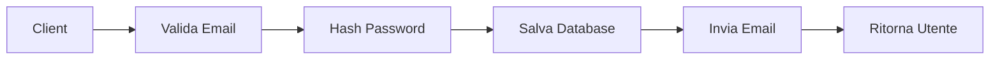

# 📚 Esempi di Documentazione Generata

Questa guida mostra esempi concreti di come l'AI genera documentazione Mintlify da modifiche al codice.

---

## Esempio 1: Nuova Funzione API

### 💻 Codice Sorgente (aggiunto in PR)

```typescript
// src/api/users.ts

/**
 * Crea un nuovo utente nel sistema
 */
export async function createUser(data: CreateUserDto): Promise<User> {
  // Validazione email
  if (!isValidEmail(data.email)) {
    throw new ValidationError('Email non valida');
  }
  
  // Hash password
  const hashedPassword = await bcrypt.hash(data.password, 10);
  
  // Crea utente nel database
  const user = await db.users.create({
    email: data.email,
    password: hashedPassword,
    name: data.name,
    role: data.role || 'user'
  });
  
  // Invia email di benvenuto
  await sendWelcomeEmail(user.email);
  
  return user;
}

interface CreateUserDto {
  email: string;
  password: string;
  name: string;
  role?: 'user' | 'admin';
}
```

### 📝 Documentazione Generata

```mdx
---
title: 'Creare un Utente'
description: 'API per la creazione di nuovi utenti nel sistema'
icon: 'user-plus'
---

## Panoramica

L'endpoint `createUser` permette di registrare nuovi utenti nella piattaforma. 
La funzione gestisce automaticamente la validazione dell'email, l'hashing della 
password e l'invio dell'email di benvenuto.

## Parametri

<ParamField path="email" type="string" required>
  Indirizzo email dell'utente. Deve essere un'email valida e unica nel sistema.
</ParamField>

<ParamField path="password" type="string" required>
  Password dell'utente. Verrà automaticamente hashata usando bcrypt prima del salvataggio.
  
  **Requisiti minimi:**
  - Minimo 8 caratteri
  - Almeno una lettera maiuscola
  - Almeno un numero
</ParamField>

<ParamField path="name" type="string" required>
  Nome completo dell'utente
</ParamField>

<ParamField path="role" type="'user' | 'admin'" default="user">
  Ruolo dell'utente nel sistema. Opzionale, default: `user`
</ParamField>

## Utilizzo

<CodeGroup>

```typescript TypeScript
import { createUser } from '@/api/users';

try {
  const newUser = await createUser({
    email: 'mario.rossi@example.com',
    password: 'SecurePass123!',
    name: 'Mario Rossi',
    role: 'user'
  });
  
  console.log('Utente creato:', newUser.id);
} catch (error) {
  console.error('Errore:', error.message);
}
```

```javascript JavaScript
const { createUser } = require('@/api/users');

createUser({
  email: 'mario.rossi@example.com',
  password: 'SecurePass123!',
  name: 'Mario Rossi'
})
  .then(user => console.log('Utente creato:', user.id))
  .catch(error => console.error('Errore:', error.message));
```

```python Python
from api.users import create_user

user = create_user(
    email='mario.rossi@example.com',
    password='SecurePass123!',
    name='Mario Rossi',
    role='user'
)
print(f'Utente creato: {user.id}')
```

</CodeGroup>

## Risposta

<ResponseField name="id" type="string">
  ID univoco dell'utente creato
</ResponseField>

<ResponseField name="email" type="string">
  Email dell'utente
</ResponseField>

<ResponseField name="name" type="string">
  Nome dell'utente
</ResponseField>

<ResponseField name="role" type="string">
  Ruolo assegnato all'utente
</ResponseField>

<ResponseField name="createdAt" type="Date">
  Data di creazione dell'account
</ResponseField>

## Gestione Errori

<Warning>
  La funzione può lanciare i seguenti errori:
</Warning>

| Errore | Causa | Soluzione |
|--------|-------|-----------|
| `ValidationError` | Email non valida | Verificare il formato dell'email |
| `DuplicateKeyError` | Email già esistente | L'utente esiste già nel sistema |
| `DatabaseError` | Errore di connessione | Verificare la connessione al database |

## Note di Sicurezza

<Info>
  **Best Practices:**
  - Le password vengono automaticamente hashate con bcrypt (10 rounds)
  - Non salvare mai password in chiaro nei log
  - Implementare rate limiting per prevenire attacchi brute force
</Info>

## Flusso di Lavoro



## Esempi Avanzati

### Con gestione errori completa

```typescript
async function registerNewUser(userData: CreateUserDto) {
  try {
    const user = await createUser(userData);
    
    // Log successo
    logger.info(`Nuovo utente registrato: ${user.email}`);
    
    // Redirect a pagina benvenuto
    return { success: true, userId: user.id };
    
  } catch (error) {
    if (error instanceof ValidationError) {
      return { success: false, error: 'Dati non validi' };
    }
    
    if (error.code === 'DUPLICATE_KEY') {
      return { success: false, error: 'Email già in uso' };
    }
    
    // Log errore imprevisto
    logger.error('Errore registrazione:', error);
    return { success: false, error: 'Errore del server' };
  }
}
```

## Vedere Anche

- [Autenticazione](/api-reference/authentication)
- [Gestione Profilo](/api-reference/user-profile)
- [Sicurezza](/concepts/security)
```

---

## Esempio 2: Breaking Change

### 💻 Codice Modificato

```typescript
// PRIMA (v1.x)
export function calculatePrice(quantity: number): number {
  return quantity * 10;
}

// DOPO (v2.0) - Breaking Change
export function calculatePrice(params: PriceParams): PriceResult {
  const basePrice = params.quantity * params.unitPrice;
  const discount = params.discount || 0;
  const tax = params.includeTax ? basePrice * 0.22 : 0;
  
  return {
    subtotal: basePrice,
    discount: basePrice * discount,
    tax,
    total: basePrice * (1 - discount) + tax
  };
}

interface PriceParams {
  quantity: number;
  unitPrice: number;
  discount?: number;
  includeTax?: boolean;
}

interface PriceResult {
  subtotal: number;
  discount: number;
  tax: number;
  total: number;
}
```

### 📝 Documentazione Generata

```mdx
---
title: 'Calcolo Prezzo'
description: 'Funzione per il calcolo del prezzo con sconti e tasse'
icon: 'calculator'
---

<Warning>
  **Breaking Change in v2.0**
  
  La firma della funzione `calculatePrice` è cambiata. Vedi la sezione 
  [Migrazione](#migrazione-da-v1x) per aggiornare il tuo codice.
</Warning>

## Panoramica

La funzione `calculatePrice` calcola il prezzo totale di un ordine, inclusi 
sconti e tasse. A partire dalla v2.0, supporta calcoli più complessi con 
gestione di sconti percentuali e IVA.

## Parametri (v2.0)

<ParamField path="quantity" type="number" required>
  Quantità di prodotti
</ParamField>

<ParamField path="unitPrice" type="number" required>
  Prezzo unitario del prodotto in euro
</ParamField>

<ParamField path="discount" type="number" default="0">
  Sconto come valore decimale (es. 0.10 per 10%)
</ParamField>

<ParamField path="includeTax" type="boolean" default="false">
  Se true, aggiunge l'IVA al 22% al totale
</ParamField>

## Utilizzo (v2.0)

```typescript
const result = calculatePrice({
  quantity: 5,
  unitPrice: 29.99,
  discount: 0.15,      // 15% di sconto
  includeTax: true
});

console.log('Subtotale:', result.subtotal);  // 149.95
console.log('Sconto:', result.discount);     // 22.49
console.log('IVA:', result.tax);             // 28.04
console.log('Totale:', result.total);        // 155.50
```

## Migrazione da v1.x

### ❌ Codice Vecchio (v1.x)

```typescript
// Questo NON funziona più in v2.0
const price = calculatePrice(5);
```

### ✅ Codice Nuovo (v2.0)

```typescript
// Opzione 1: Minimo cambiamento
const result = calculatePrice({
  quantity: 5,
  unitPrice: 10  // Era hardcoded a 10 in v1.x
});
const price = result.total;

// Opzione 2: Usa tutte le nuove feature
const result = calculatePrice({
  quantity: 5,
  unitPrice: 10,
  discount: 0.1,
  includeTax: true
});
```

### Script di Migrazione

```typescript
// Helper per facilitare la migrazione
function calculatePriceV1Compatible(quantity: number): number {
  const result = calculatePrice({
    quantity,
    unitPrice: 10,
    discount: 0,
    includeTax: false
  });
  return result.total;
}

// Usa questo durante la transizione
const price = calculatePriceV1Compatible(5);
```

## Timeline di Deprecazione

| Versione | Status | Note |
|----------|--------|------|
| v1.x | ⚠️ Deprecato | Funziona ma con warning |
| v2.0 | ✅ Corrente | Breaking change |
| v2.1+ | 🚀 Futuro | Rimozione completa v1.x |

<Tip>
  **Raccomandazione**: Migra il prima possibile alla v2.0. Il supporto per 
  la vecchia API terminerà con la v2.1 (prevista Q2 2025).
</Tip>
```

---

## Esempio 3: Componente React

### 💻 Componente Aggiunto

```tsx
// src/components/UserCard.tsx

import { Avatar } from './Avatar';
import { Badge } from './Badge';

interface UserCardProps {
  user: {
    id: string;
    name: string;
    email: string;
    avatar?: string;
    role: 'user' | 'admin';
  };
  onEdit?: (userId: string) => void;
  onDelete?: (userId: string) => void;
  compact?: boolean;
}

export function UserCard({ 
  user, 
  onEdit, 
  onDelete,
  compact = false 
}: UserCardProps) {
  return (
    <div className={`user-card ${compact ? 'compact' : ''}`}>
      <Avatar src={user.avatar} alt={user.name} />
      
      <div className="user-info">
        <h3>{user.name}</h3>
        <p>{user.email}</p>
        <Badge variant={user.role === 'admin' ? 'primary' : 'secondary'}>
          {user.role}
        </Badge>
      </div>
      
      {!compact && (
        <div className="user-actions">
          {onEdit && (
            <button onClick={() => onEdit(user.id)}>
              Modifica
            </button>
          )}
          {onDelete && (
            <button onClick={() => onDelete(user.id)}>
              Elimina
            </button>
          )}
        </div>
      )}
    </div>
  );
}
```

### 📝 Documentazione Generata

```mdx
---
title: 'UserCard'
description: 'Componente per visualizzare informazioni utente in formato card'
icon: 'address-card'
---

## Panoramica

Il componente `UserCard` mostra le informazioni di un utente in un formato card 
pulito e consistente. Supporta azioni di modifica/eliminazione e una modalità compatta.

## Props

<ParamField path="user" type="User" required>
  Oggetto contenente i dati dell'utente da visualizzare
  
  ```typescript
  {
    id: string;
    name: string;
    email: string;
    avatar?: string;
    role: 'user' | 'admin';
  }
  ```
</ParamField>

<ParamField path="onEdit" type="(userId: string) => void">
  Callback chiamata quando si clicca il pulsante "Modifica"
</ParamField>

<ParamField path="onDelete" type="(userId: string) => void">
  Callback chiamata quando si clicca il pulsante "Elimina"
</ParamField>

<ParamField path="compact" type="boolean" default="false">
  Se true, nasconde i pulsanti azione per una visualizzazione più compatta
</ParamField>

## Utilizzo Base

```tsx
import { UserCard } from '@/components/UserCard';

function UserList() {
  const user = {
    id: '123',
    name: 'Mario Rossi',
    email: 'mario@example.com',
    avatar: 'https://...',
    role: 'user'
  };
  
  return <UserCard user={user} />;
}
```

## Con Azioni

```tsx
function UserList() {
  const handleEdit = (userId: string) => {
    console.log('Modifica utente:', userId);
    // Apri modale di modifica
  };
  
  const handleDelete = (userId: string) => {
    if (confirm('Sei sicuro?')) {
      // Elimina utente
    }
  };
  
  return (
    <UserCard 
      user={user}
      onEdit={handleEdit}
      onDelete={handleDelete}
    />
  );
}
```

## Modalità Compatta

```tsx
// Utile per liste dense o sidebar
<UserCard user={user} compact />
```

## Esempi Visivi

### Normale


### Compatta


### Con Admin Badge


## Styling

Il componente usa le seguenti classi CSS che puoi personalizzare:

```css
.user-card {
  /* Card container */
}

.user-card.compact {
  /* Stile compatto */
}

.user-info {
  /* Info section */
}

.user-actions {
  /* Pulsanti azione */
}
```

## Accessibilità

<Info>
  Il componente è progettato con accessibilità in mente:
  - Supporto completo per keyboard navigation
  - Screen reader friendly
  - Focus indicators visibili
  - ARIA labels appropriati
</Info>

## Vedere Anche

- [Avatar Component](/components/avatar)
- [Badge Component](/components/badge)
- [User Management](/guides/user-management)
```

---

## Riepilogo Vantaggi

### ✅ Cosa genera automaticamente l'AI:

1. **Struttura completa** - Frontmatter, sezioni, headers
2. **Componenti Mintlify** - Tip, Warning, ParamField, etc.
3. **Esempi pratici** - CodeGroup multi-linguaggio
4. **Gestione errori** - Tabelle e casi d'uso
5. **Breaking changes** - Warning e guide migrazione
6. **Best practices** - Tips e note di sicurezza
7. **Diagrammi** - Mermaid per flussi
8. **Cross-references** - Link a pagine correlate
9. **Accessibilità** - Note su A11y
10. **Styling** - Guide CSS quando rilevante

### 🎯 Qualità della documentazione:

- **Consistenza**: Stile uniforme su tutta la docs
- **Completezza**: Copre tutti gli aspetti del codice
- **Esempi**: Sempre pratici e funzionanti
- **Manutenibilità**: Facile da aggiornare
- **SEO-friendly**: Metadata e descrizioni ottimizzate

---

**Questi sono solo esempi - l'AI si adatta al TUO codice e al TUO stile! 🚀**
