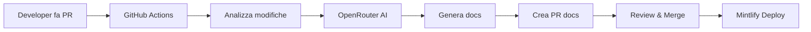

# 🤖📚 Auto-Docs Framework

Framework completo per documentazione automatica usando **Mintlify**, **OpenRouter** e **GitHub Actions**.

[](https://opensource.org/licenses/MIT)
[](https://mintlify.com)
[](https://openrouter.ai)

---

## 🎯 Cos'è?

Un sistema intelligente che:
- 🔍 **Analizza** automaticamente le modifiche al codice
- 🤖 **Genera** documentazione usando AI (Claude, GPT-4, ecc.)
- 📝 **Aggiorna** la tua documentazione Mintlify
- 🚀 **Deploya** automaticamente ad ogni merge

**Zero configurazione manuale. Zero maintenance. 100% automatico.**

---

## ✨ Features

- ✅ **Multi-Model**: Usa Claude, GPT-4, Gemini tramite OpenRouter
- ✅ **Smart Detection**: Rileva automaticamente file correlati
- ✅ **Context-Aware**: Comprende modifiche e impatto
- ✅ **Mintlify Native**: Genera .mdx perfetti con componenti Mintlify
- ✅ **Auto-PR**: Crea PR separate per review documentazione
- ✅ **Configurable**: Personalizza prompt, modelli, logica
- ✅ **Cost-Effective**: Ottimizzato per minimizzare token usage
- ✅ **Monitoring**: Traccia metriche e costi

---

## 🚀 Quick Start

### 1. Clona e Setup

```bash
# Clona questo template
git clone https://github.com/tuo-username/auto-docs-framework.git
cd auto-docs-framework

# Installa dipendenze
cd scripts && npm install
```

### 2. Configura Mintlify

```bash
# Inizializza Mintlify
npx mintlify@latest init

# Testa localmente
cd docs && npx mintlify dev
```

### 3. Aggiungi API Keys

```bash
# GitHub Secrets
gh secret set OPENROUTER_API_KEY --body "sk-or-v1-..."

# O manualmente su GitHub:
# Settings → Secrets → Actions → New repository secret
```

### 4. Commit & Push

```bash
git add .
git commit -m "feat: setup auto-docs"
git push origin main

# Crea una PR e guarda la magia! ✨
```

**Fatto!** Il tuo sistema è attivo. 🎉

---

## 📖 Documentazione Completa

- 📘 **[Getting Started](./GETTING-STARTED.md)** - Guida passo-passo dettagliata
- 🏗️ **[Blueprint](./BLUEPRINT.md)** - Architettura e design del sistema
- ⚙️ **[Configuration](./docs/configuration.mdx)** - Opzioni avanzate
- 🔧 **[Customization](./docs/customization.mdx)** - Personalizzazioni
- 📊 **[Monitoring](./docs/monitoring.mdx)** - Metriche e dashboard

---

## 💡 Come Funziona



### Workflow in dettaglio:

1. **PR Trigger**: Apri una PR con modifiche al codice
2. **File Detection**: GitHub Actions rileva file modificati
3. **Context Building**: Script costruisce contesto con diff e docs esistenti
4. **AI Processing**: OpenRouter (Claude/GPT) analizza e genera documentazione
5. **Update Apply**: Nuove pagine create, esistenti aggiornate
6. **PR Creation**: Nuova PR automatica con modifiche docs
7. **Human Review**: Revisione e approvazione
8. **Auto Deploy**: Mintlify deploya automaticamente

---

## 🎨 Esempio

**Input** (modifiche al codice):

```typescript
// src/auth/login.ts
export async function login(email: string, password: string) {
  // Nuova feature: 2FA support
  const { token, requires2FA } = await authenticate(email, password);
  
  if (requires2FA) {
    return { status: 'pending_2fa', token: null };
  }
  
  return { status: 'success', token };
}
```

**Output** (documentazione generata):

```mdx
---
title: 'Login'
description: 'Autenticazione utente con supporto 2FA'
icon: 'lock'
---

## Panoramica

La funzione `login` gestisce l'autenticazione degli utenti con supporto opzionale per autenticazione a due fattori (2FA).

## Utilizzo

<CodeGroup>
```typescript Login Base
const result = await login('user@example.com', 'password123');

if (result.status === 'success') {
  console.log('Token:', result.token);
}
```

```typescript Con 2FA
const result = await login('user@example.com', 'password123');

if (result.status === 'pending_2fa') {
  // Richiedi codice 2FA all'utente
  const code = await prompt2FACode();
  const verified = await verify2FA(code);
}
```
</CodeGroup>

## Parametri

<ParamField path="email" type="string" required>
  Email dell'utente
</ParamField>

<ParamField path="password" type="string" required>
  Password dell'utente
</ParamField>

## Risposta

<ResponseField name="status" type="string">
  Può essere `'success'` o `'pending_2fa'`
</ResponseField>

<ResponseField name="token" type="string | null">
  JWT token se login riuscito, `null` se richiesto 2FA
</ResponseField>

<Warning>
  **Breaking Change**: Aggiunto supporto 2FA in v2.0. 
  Controlla sempre il campo `status` nella risposta.
</Warning>
```

---

## ⚙️ Configurazione

### Modelli AI

Modifica `.doc-agent-config.json`:

```json
{
  "model": "anthropic/claude-3.5-sonnet",
  "fallbackModels": [
    "openai/gpt-4-turbo",
    "google/gemini-pro-1.5"
  ],
  "temperature": 0.3,
  "maxTokens": 4000
}
```

### Trigger Files

In `.github/workflows/auto-docs.yml`:

```yaml
paths:
  - '**.ts'
  - '**.tsx'
  - '**.py'
  - '**.go'
  # Aggiungi altri pattern...
```

### Prompt Personalizzati

In `scripts/prompt-templates.js`:

```javascript
export const SYSTEM_PROMPT = `
  Il tuo prompt personalizzato...
  Linee guida specifiche...
  Stile della tua azienda...
`;
```

---

## 💰 Costi

### Stima approssimativa (Claude 3.5 Sonnet):

| Dimensione PR | Token Input | Token Output | Costo |
|--------------|-------------|--------------|-------|
| Small (1-3 files) | ~2,000 | ~1,000 | $0.009 |
| Medium (4-10 files) | ~8,000 | ~4,000 | $0.036 |
| Large (10+ files) | ~20,000 | ~10,000 | $0.090 |

**Costo medio mensile**: $5-20 per progetto attivo

💡 **Tip**: Usa modelli più economici per draft, Claude per final review.

---

## 🛠️ Troubleshooting

### Workflow non si attiva

```bash
# Controlla permessi
Settings → Actions → General → Workflow permissions
✓ Read and write permissions
✓ Allow GitHub Actions to create and approve pull requests
```

### API Rate Limits

```javascript
// Aggiungi retry logic in doc-agent.js
const response = await retryWithBackoff(
  () => openai.chat.completions.create({...}),
  { maxRetries: 3, backoff: 2000 }
);
```

### Qualità documentazione bassa

```javascript
// Migliora il prompt
// 1. Aggiungi più contesto
// 2. Fornisci esempi
// 3. Specifica formato desiderato
// 4. Usa temperature più bassa (0.2-0.3)
```

### Loop infiniti

```yaml
# In workflow, assicurati di escludere docs/
paths:
  - '!docs/**'  # FONDAMENTALE!
```

---

## 🤝 Contribuire

Contributi benvenuti! 

1. Fork il progetto
2. Crea feature branch (`git checkout -b feature/amazing`)
3. Commit (`git commit -m 'Add amazing feature'`)
4. Push (`git push origin feature/amazing`)
5. Apri Pull Request

---

## 📚 Risorse

### Documentazione

- [Mintlify Documentation](https://mintlify.com/docs)
- [OpenRouter API Reference](https://openrouter.ai/docs)
- [GitHub Actions Guide](https://docs.github.com/actions)

### Community

- [Discord Server](#) - Unisciti alla community
- [GitHub Discussions](#) - Fai domande
- [Issues](#) - Segnala bug

### Blog & Tutorials

- [Blog Post: Building Auto-Docs](#)
- [Video Tutorial](#)
- [Use Cases](#)

---

## 📊 Roadmap

- [x] Core framework
- [x] Mintlify integration
- [x] OpenRouter support
- [x] GitHub Actions workflow
- [ ] Multi-repository support
- [ ] Screenshot automation
- [ ] Video tutorial generation
- [ ] A/B testing prompts
- [ ] Dashboard analytics
- [ ] Slack/Discord notifications
- [ ] Custom Mintlify components
- [ ] Auto-translation (multi-language)

---

## 🌟 Showcase

Progetti che usano questo framework:

- **[Tuo Progetto](https://docs.tuoprogetto.com)** - Descrizione
- **[Altro Progetto](#)** - Descrizione

Vuoi essere aggiunto? Apri una PR!

---

## 📄 Licenza

MIT License - vedi [LICENSE](LICENSE) per dettagli.

---

## 👏 Credits

Ispirato da:
- [Article by Dan Avila](https://medium.com/@dan.avila7/automated-documentation-with-claude-code-building-self-updating-docs-using-docusaurus-agent-2c85d3ec0e19)
- [Mintlify Team](https://mintlify.com)
- [OpenRouter](https://openrouter.ai)

Creato con ❤️ per la developer community.

---

## 📞 Support

Hai domande? Bisogno di aiuto?

- 📧 Email: support@tuoprogetto.com
- 💬 Discord: [Join Server](#)
- 🐦 Twitter: [@tuoaccount](#)
- 🌐 Website: [tuoprogetto.com](#)

---

<div align="center">

**[⭐ Star su GitHub](https://github.com/tuo-username/auto-docs-framework)** se trovi utile questo progetto!

Fatto con 🤖 e ❤️

</div>
